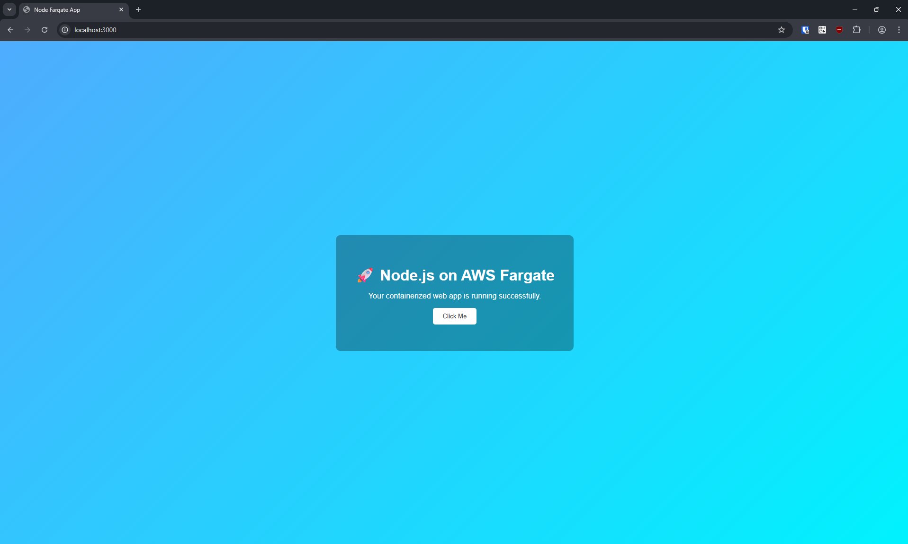

# AWS ECS Fargate CI/CD Deployment

A containerized Node.js application deployed to **Amazon ECS Fargate** with an automated CI/CD pipeline using **GitHub Actions**, **Docker**, and **Amazon ECR**.

Every push to the `main` branch automatically builds a new Docker image, pushes it to Amazon ECR, creates an updated ECS task definition, and deploys the new application version to Amazon ECS.

---

## Architecture

```text
Developer
    |
    | git push
    v
GitHub Repository
    |
    v
GitHub Actions
    |
    | Build Docker Image
    v
Docker
    |
    | Push Image
    v
Amazon ECR
    |
    | Image URI
    v
ECS Task Definition
    |
    | New Revision
    v
Amazon ECS
    |
    v
AWS Fargate
    |
    v
Node.js Application
```

---

## Technology Stack

| Category | Technologies |
|----------|--------------|
| Cloud Provider | Amazon Web Services (AWS) |
| Container Platform | Amazon ECS |
| Compute | AWS Fargate |
| Container Registry | Amazon ECR |
| Application | Node.js, Express.js |
| Containerization | Docker, Docker Compose |
| CI/CD | GitHub Actions |
| AWS Integration | AWS CLI, GitHub Actions for AWS |
| Image Versioning | Git Commit SHA |
| Health Check | `/health` endpoint |

---

## Key Features

- Containerized Node.js application using Docker
- Serverless container deployment with AWS Fargate
- Docker image storage using Amazon ECR
- Automated CI/CD pipeline with GitHub Actions
- Automatic deployments when changes are pushed to `main`
- Immutable Docker image tagging using Git commit SHA
- Automated ECS task-definition updates
- ECS service deployment with stability checks
- Application health-check endpoint
- Local Docker development support

---

## Application

The application uses **Node.js and Express.js** and listens on port `3000`.

Static website files are served from the `public/` directory.

A simple health-check endpoint is also available:

```text
GET /health
```

Expected response:

```text
OK
```

---

## CI/CD Workflow

The deployment workflow is located at:

```text
.github/workflows/deploy.yml
```

The pipeline runs automatically whenever code is pushed to the `main` branch.

### Deployment Flow

1. Checkout the repository.
2. Configure AWS credentials.
3. Authenticate GitHub Actions with Amazon ECR.
4. Build the Docker image.
5. Tag the image using the Git commit SHA.
6. Push the Docker image to Amazon ECR.
7. Download the current ECS task definition.
8. Replace the container image with the newly built ECR image.
9. Register the updated task definition.
10. Deploy the new task definition to the ECS service.
11. Wait for the ECS service to reach a stable state.

```text
Push to main
     |
     v
GitHub Actions
     |
     v
docker build
     |
     v
Amazon ECR
     |
     v
Render ECS Task Definition
     |
     v
Deploy ECS Service
     |
     v
AWS Fargate
```

---

## Immutable Image Versioning

Each Docker image is tagged using the Git commit SHA:

```text
ECR_REPOSITORY:<github-sha>
```

For example:

```text
123456789012.dkr.ecr.ap-southeast-1.amazonaws.com/node-app:a8f42c7
```

Using the commit SHA makes each deployment traceable to the exact application version that produced the container image.

---

## Project Structure

```text
aws-ecs-fargate-cicd/
│
├── .github/
│   └── workflows/
│       └── deploy.yml
│
├── public/
│   ├── index.html
│   └── styles.css
│
├── .dockerignore
├── .gitignore
├── Dockerfile
├── docker-compose.yml
├── app.js
├── package.json
├── package-lock.json
├── README.md
├── LICENSE
└── result.png
```

---

## Run Locally

### Clone the Repository

```bash
git clone https://github.com/lehibonafe/aws-ecs-fargate-cicd.git
cd aws-ecs-fargate-cicd
```

### Install Dependencies

```bash
npm install
```

### Start the Application

```bash
npm start
```

Open:

```text
http://localhost:3000
```

Check application health:

```bash
curl http://localhost:3000/health
```

Expected output:

```text
OK
```

---

## Run with Docker

Build the Docker image:

```bash
docker build -t node-fargate-app .
```

Run the container:

```bash
docker run --rm -p 3000:3000 node-fargate-app
```

Open:

```text
http://localhost:3000
```

Verify the health endpoint:

```bash
curl http://localhost:3000/health
```

---

## Docker Image

The application uses a lightweight Node.js Alpine image:

```dockerfile
FROM node:24-alpine
```

The container:

1. Creates an `/app` working directory.
2. Copies the Node.js package files.
3. Installs application dependencies.
4. Copies the application source code.
5. Exposes port `3000`.
6. Starts the application using `npm start`.

---

## AWS Resources

The deployment architecture uses the following AWS resources:

| AWS Service | Purpose |
|-------------|---------|
| Amazon ECS | Container orchestration |
| AWS Fargate | Serverless container compute |
| Amazon ECR | Docker image registry |
| AWS IAM | GitHub Actions and ECS permissions |
| ECS Task Definition | Defines the application container |
| ECS Service | Maintains and deploys running tasks |

---

## GitHub Actions Configuration

The workflow requires the following GitHub repository secrets:

| Secret | Purpose |
|--------|---------|
| `AWS_ACCESS_KEY_ID` | AWS authentication |
| `AWS_SECRET_ACCESS_KEY` | AWS authentication |
| `AWS_REGION` | AWS deployment region |
| `ECR_REPOSITORY` | Amazon ECR repository name |
| `ECS_CLUSTER` | ECS cluster name |
| `ECS_SERVICE` | ECS service name |

The current ECS task definition used by the deployment workflow is:

```text
node-fargate-app
```

and the container name is:

```text
node-fargate-app-container
```

---

## Deployment Process

When a change is pushed:

```bash
git add .
git commit -m "Update application"
git push origin main
```

GitHub Actions automatically starts the deployment pipeline.

The pipeline builds an image similar to:

```text
<aws-account>.dkr.ecr.<region>.amazonaws.com/<repository>:<commit-sha>
```

The workflow then updates the ECS task definition with the new image and deploys it to the configured ECS service.

---

## Security Considerations

The deployment pipeline should follow least-privilege IAM practices.

The GitHub deployment identity should only have the permissions required to:

- Authenticate with Amazon ECR
- Push Docker images to ECR
- Read and register ECS task definitions
- Update the ECS service
- Pass the required ECS IAM roles

For production environments, **GitHub Actions OIDC with AWS IAM** is recommended instead of storing long-lived AWS access keys as GitHub secrets.

---

## Reliability

The deployment workflow uses:

```yaml
wait-for-service-stability: true
```

This causes GitHub Actions to wait for the ECS deployment to reach a stable state before considering the deployment successful.

The Node.js application also provides:

```text
/health
```

which can be used by container or load-balancer health checks.

---

## Engineering Concepts Demonstrated

This project demonstrates hands-on experience with:

- Amazon ECS
- AWS Fargate
- Amazon ECR
- Docker containerization
- Docker image lifecycle management
- ECS task definitions
- ECS services
- CI/CD automation
- GitHub Actions
- Immutable image tagging
- Node.js application deployment
- AWS IAM permissions
- Automated application releases
- Deployment health and stability checks

---

## Screenshot



---

## Future Improvements

Potential improvements include:

- Replace long-lived AWS credentials with GitHub Actions OIDC
- Add an Application Load Balancer
- Configure ECS container health checks
- Add Amazon CloudWatch Logs
- Add ECS Service Auto Scaling
- Provision infrastructure with Terraform
- Add separate development and production environments
- Add automated application tests before deployment
- Add container vulnerability scanning
- Implement deployment rollback strategies

---

## License

See the [LICENSE](LICENSE) file for details.
